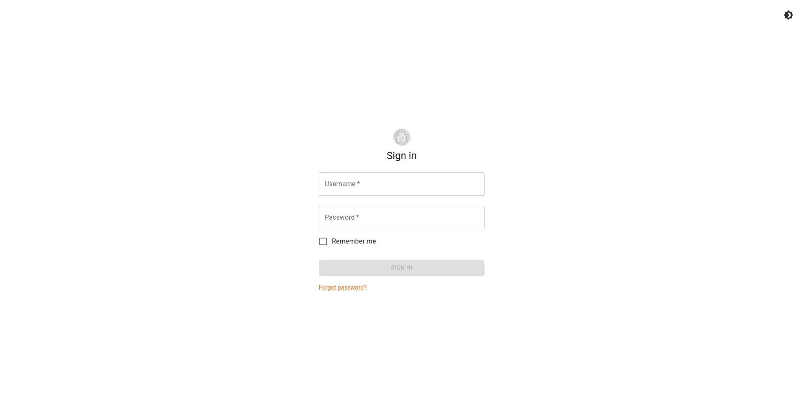

# Installation

!!! info "Base OS Selection"

    This deployment has only been tested on **Fedora 38/39** and **Ubuntu 22.04**

## Automatic Installation (Recommended)

Use the auto-installer to download CBLE and its prerequisites:

```shell
. <(curl -fsSL https://get.cble.io)
```

!!! warning "Shell Support"

    The auto installer has only been tested with the **zsh** and **bash** shells

Follow the automatic installer prompts to automatically configure CBLE:

```shell
Installing Docker...
# Executing docker install script, commit: xxxxxxxxxxxxxxxxxxxxxxxxxxxxxxxxx
# ... docker install output ...

Cloning into 'cble'...
# ... git output ...
Would you like to perform auto-configuration of CBLE? [Y/n] Y
Are you using SSL (requires DNS to be set up)? [Y/n] Y
What is the domain (FQDN) you plan to use (e.g. cble.io): <your fqdn>
Would you like to generate random passwords/keys? [Y/n] Y
Default admin account username [cble]: cble
Default admin account first name [CBLE]: CBLE
Default admin account last name [Admin]: Admin

CBLE has been installed and auto-configured!

Once ready, start CBLE with:

    cd cble
    docker compose -f docker-compose.local.yml build
    docker compose -f docker-compose.local.yml up -d

Then log in with the following credentials:

    Name: CBLE Admin
    Username: cble
    Password: <random password>
```

Now run CBLE with:

```shell
cd cble
docker compose -f docker-compose.local.yml build
docker compose -f docker-compose.local.yml up -d
```

## Manual Installation

### Installation Methods

#### Docker (Recommended)

Install [Docker](https://docker.com) with:

```shell
curl -fsSL https://get.docker.com/ | sh
```

Clone the CBLE repository:

```shell
git clone https://github.com/cble-platform/cble
```

Move into the deploy directory and create local configuration files from the provided examples:

```shell
cd cble
cp config.example.yaml config.local.yaml
cp Caddyfile.example Caddyfile
cp docker-compose.yml docker-compose.local.yml
```

To start CBLE, first build the container images and the run the containers:

```shell
docker compose -f docker-compose.local.yml build
docker compose -f docker-compose.local.yml up -d
```

#### System-wide

Coming soon.

### Configuration

For these next steps you'll need to know the Fully Qualified Domain Name (FQDN) of the deployment. This
would look something like `https://docs.cble.io`.

!!! tip "FQDN Configuration"

    The FQDN *must* have DNS set up in order to perform automatic TLS certificate provisioning. Be sure
    to set up your DNS `A/AAAA` records to point to the CBLE server.

First, edit the `config.local.yaml` file (see
[Config File Reference](../references/config-file.md) for more options):

```yaml title="config.local.yaml"
# ...
server:
  hostname: <your fqdn>
  # ...
  ssl: true # enable this to auto-provision a TLS certificate
  # ...
  origins:
    - https://<your fqdn> # put your FQDN here
# ...
database:
  # ...
  password: <secure password> # set this to a secure password for the database
# ...
auth:
  jwt_key: <random jwt key> # generate a random value here
  # (easy method; requires node) node -e "console.log(require('crypto').randomBytes(64).toString('hex'));"
  # ...
initialization:
  default_admin:
    # ...
    password: <secure password> # generate a secure password for the default admin user
  # ...
```

Place your FQDN at the top of the `Caddyfile`:

```text title="Caddyfile"
<your fqdn> { # be sure to delete the "http://" at the beginning
    # ...
}
```

Update the configuration in the `docker-compose.local.yml`:

```yaml title="docker-compose.local.yaml"
services:
  frontend:
    build:
      # ...
      args:
        - VITE_API_BASE_URL=https://<your fqdn> # put your FQDN here
    # ...
  backend:
    # ...
  db:
    # ...
    environment:
      # ...
      - POSTGRES_PASSWORD=<secure password> # secure password from the `database` section of `config.local.yaml`
      # ...
```

## Login to CBLE

You can now visit the CBLE dashboard at `https://<your fqdn>`. You should be greeted with the login page:

{ loading=lazy }

Log in with the username and password you created during configuration.
