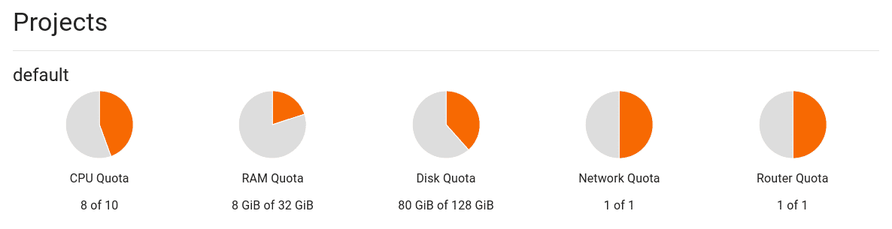

# Overview

Projects provide a scope to contain **Blueprints** and **Deployments**. This scope allows CBLE to track the usage and
access to all objects within a project for all users.

In the scope of blueprints, projects act as a library or catalog of blueprints that users can access to deploy. A blueprint
*must* have a parent project to live in, otherwise, CBLE would not be able to perform access control on blueprints.

When requesting a deployment, the user must select a project to deploy it into. Projects track the combinerd resource usage
of all the deployments within it and ensure that the project's resource quota's are not exceeded. This enables administrators
to limit how many resources any given user/group is using. Deployments *do not* have to be deployed into the same project
as the blueprint and in fact this enables a use case where you can have a "General Catalog" project containing blueprints
all users can access and then a "*&lt;Username&gt;*'s Project" for each user to deploy into.
