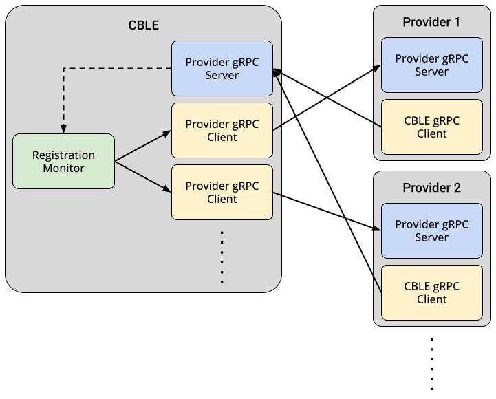
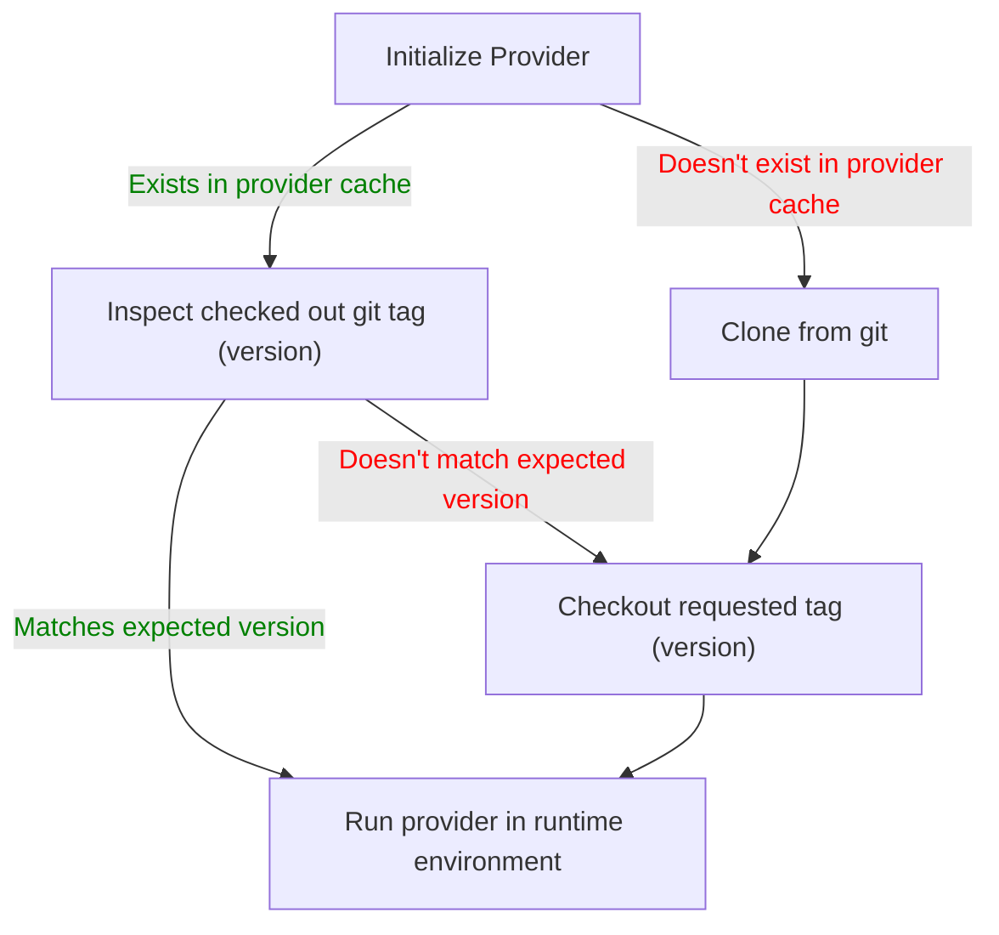
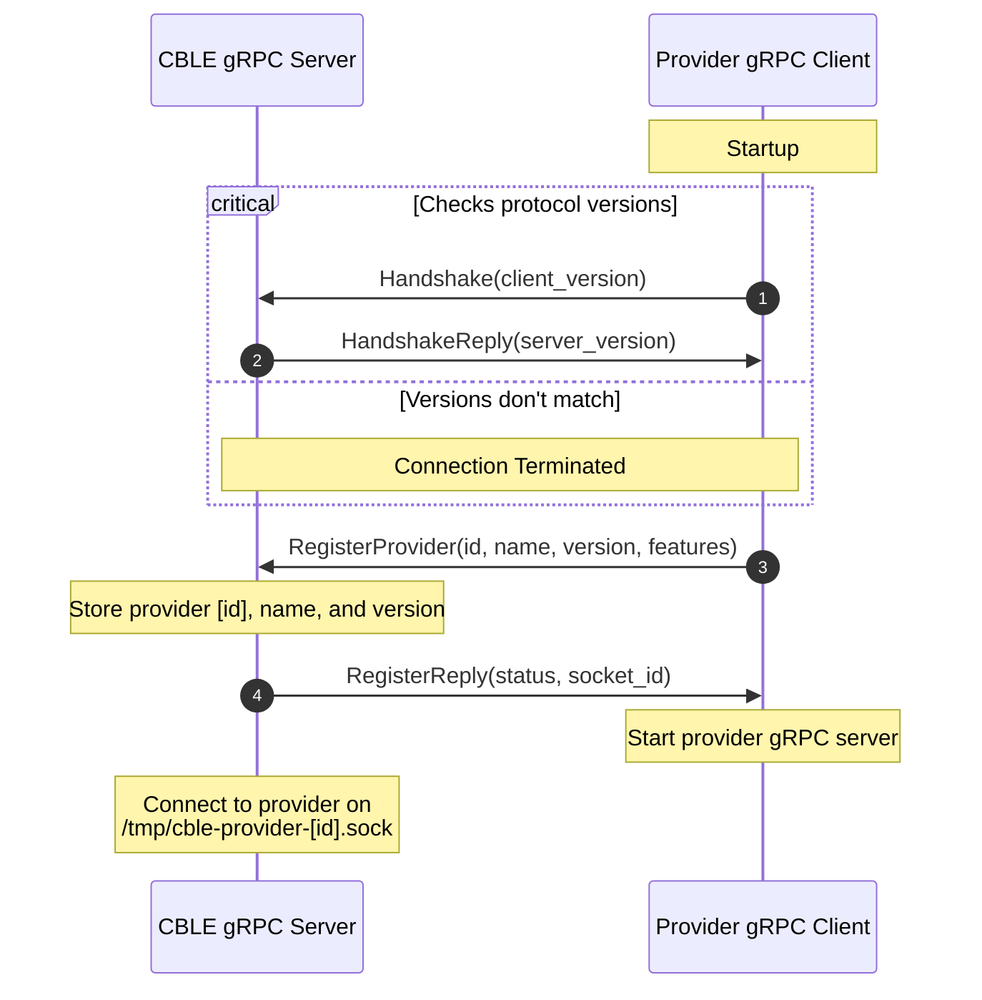
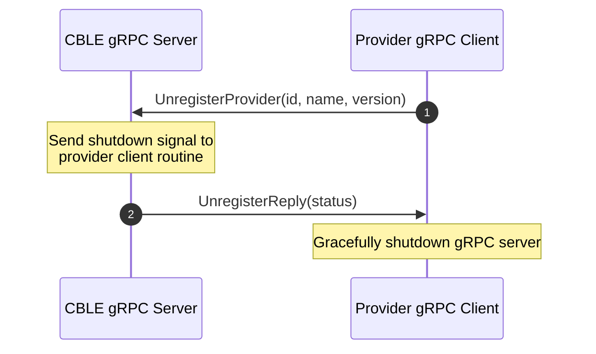

# How it Works

## Design

The CBLE server is designed to connect to many different providers at once. In doing so, a main go routine monitoring all
incoming [registration requests](#registration) wait for registrations. Once one is received, a new go routine is spawned
with a client to connect to that provider's gRPC server.

<figure markdown>
  { width="100%" }
  <figcaption>CBLE Provider gRPC Design</figcaption>
</figure>

## Loading Providers

To load providers into CBLE, you must provide a Git remote, tag (version), and name for the provider. This will be used
to fetch and compile the provider into the provider cache.

The basic flow of loading CBLE providers is as follows:



This flow is triggered on startup for CBLE for any pre-existing providers in the database and can be triggered manually
by calling the `loadProvider` GraphQL mutation.

## Runtime

Providers use one of two supported runtime environments: `docker` or `shell`. This is configured using the `type` value
in the `cble-metadata.yml` file located in the root of the provider.

```yaml title="Example of cble-metadata.yml from provider-openstack"
# From https://github.com/cble-platform/provider-openstack/blob/main/cble-metadata.yml

name: provider-openstack
description: Builder that interfaces with Openstack
author: Bradley Harker <github.com/BradHacker>
version: v1.0.0-alpha

type: docker

docker:
dockerfile: Dockerfile
cmd: ./provider_openstack
```

For more information on writing a `cble-metadata.yml` file, see [Writing a Provider](./writing-a-provider.md#metadata).

## Registration

Providers, on startup, will register themselves with the CBLE server in order to establish a peristent gRPC connection.
This process also prevents rogue providers from starting up without knowing the provider ID ahead of time.

After an initial handshake process, the provider will start up its own gRPC server which can be used to provider commands
to the provider. This process is as follows:



## Commands

As of now, there are a few pre-defined commands the CBLE server can issue to providers. These are `Configure`, `Deploy`,
and `Destroy`.

These commands are issued via the gRPC provider client for the specified provider. Very rarely will you have to directly
interact with these as they are abstracted by GraphQL mutations within the CBLE API.

### `Configure`

This command is used to reload the configuration of a provider without having to restart the provider itself.
Configurations are stored within the CBLE database for portability and because of this, this command is executed on each
startup of the providers.

### `Deploy`

This command deploys a given blueprint. The deployment state and any variables stored are returned to CBLE as maps.

!!! note

    This command will eventually return a gRPC stream in order to provider real-time feedback on deployment progress.
    You can track the progress of that [here](https://github.com/cble-platform/cble-backend/issues/22).

### `Destroy`

This command destroys a given deployment. The deployment state and any variables stored are returned to CBLE as maps.

!!! note

    This command will eventually return a gRPC stream in order to provider real-time feedback on deployment progress.
    You can track the progress of that [here](https://github.com/cble-platform/cble-backend/issues/22).

## Unregistration

Unregistration occurs when a provider is ready to shutdown and would like to do so gracefully. Without this, the gRPC
clients created by the CBLE server would panic. To accomplish this, the provider will send an unregister request to the
CBLE server (using it's gRPC client) and then will gracefully shutdown it's gRPC server, disconnecting all clients in
the process.


