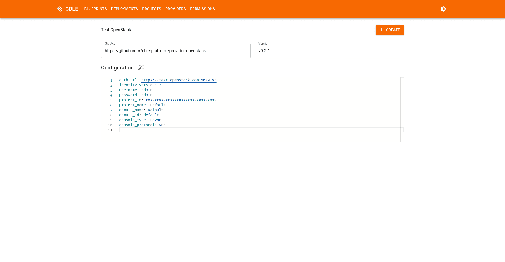
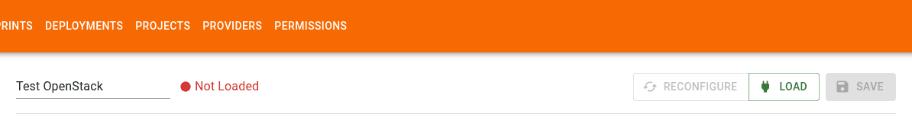
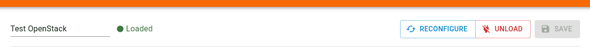
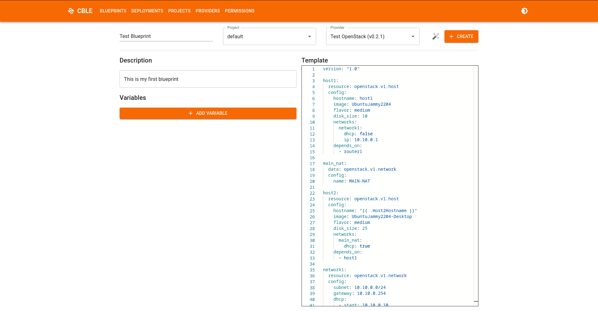
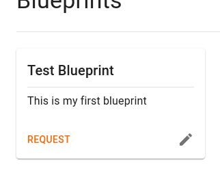
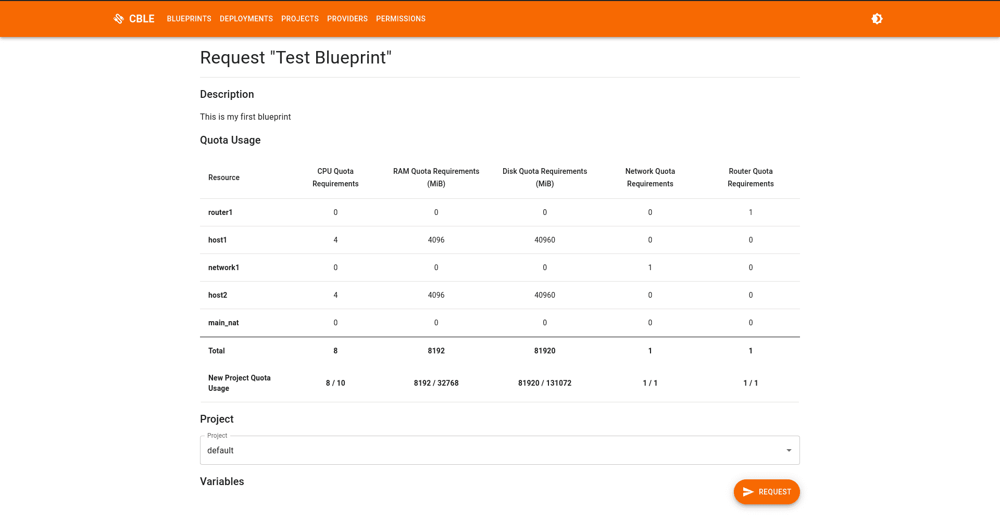
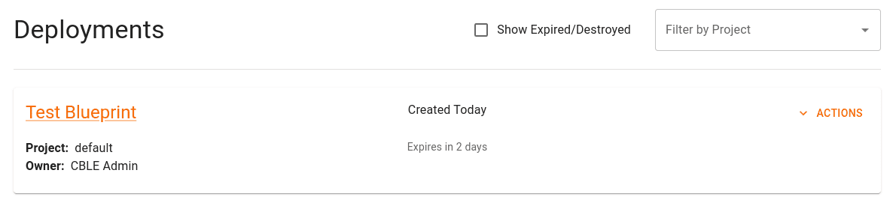
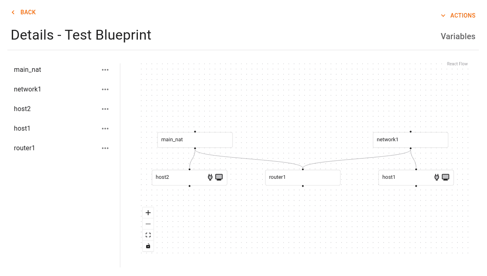
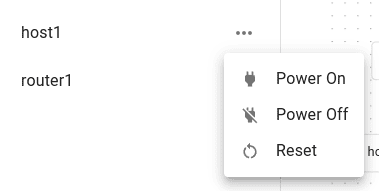
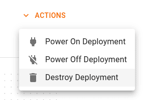

# Quick Introduction

**CBLE** is a highly scalable and flexible platform providing a fully automated self-service lab portal making teaching
with hands-on virtual lab content easy and fast. It's designed to use cloud-agnostic resources defined in blueprints which
use complex dependency-graphs to enable the fastest possible deployments.

<figure markdown="span">
    { style="width: 100%; max-width: 20rem" }
    { style="width: 100%; max-width: 20rem" }
</figure>

!!! info "Before You Continue"

    Make sure you have installed and configured CBLE using the [Installation](installation.md) guide.

## Create Your First Provider

CBLE uses [Providers](./providers/overview.md) to connect to cloud providers. They provide a way to abstract the
complex nuance of deploying infrastructure to clouds like Amazon Web Services or Microsoft Azure.

To get create your first provider:

1. Navigate to the **Providers** tab in the main navigation bar
2. Click the **Create** button
3. Give the provider a **Name**
4. Enter the **Git URL** to the provider (see [Supported Providers](./providers/overview.md#supported-providers))
5. Select/Enter a **Version** to use (dropdown should be auto-populated)
6. Enter the **Configuration** for the provider (the provider repository will provide an example configuration)
7. Click the **Create** button to create the provider

!!! note

    The provider version can be a Git **Tag** or **Commit Hash**

{ loading=lazy }

## Load Your Provider

Providers have to be loaded into the provider cache (see [Providers - How it Works](./providers/how-it-works.md)) to be
used by CBLE. Providers are loaded into the provider cache  automatically when CBLE boots, however, after creation they
must be loaded manually.

Now that you've created your first provider, you can load the provider by clicking the **Load** button.

{ loading=lazy }

If successful, a **Loaded Provider!** notification should appear.

> The usual cause of errors during when loading is an incorrect configuration. Double-check your config and try loading
> again

If you need to modify the configuration after a provider is loaded, you can use the **Reconfigure** button to update the
configuration without reloading the provider.

{ loading=lazy }

## Create Your First Blueprint

[Blueprints](./blueprints/overview.md) are a way to define an environment that your users can request a copy of. Upon
request, the blueprint will be used to create an individual deployment of this environment.

!!! note

    Blueprints will be specific to the provider you've selected. Please visit the provider's repository to find example
    templates that can be used with your provider.

To create your first blueprint:

1. Navigate to the **Blueprints** tab in the main navigation bar
2. Click the **Create** button
3. Give the blueprint a **name**
4. Select the **provider** you just created
5. Provide a **description** for the blueprint
6. Place a sample blueprint from your provider into the **template** field
7. Click the **Create** button to save the blueprint

{ loading=lazy }

!!! failure "Fixing Common Errors"

    If you get a `Failed to update blueprint: failed to load resource: ...` error, this indicates something is wrong
    with your blueprint and your provider is unable to understand it. Make sure to double-check your template syntax.

## Request Your First Deployment

Now that you've created your first blueprint, it should appear on the **Blueprints** page:

<figure markdown="span">
    
</figure>

You're ready to request a deployment of the test environment. To do so, click the **Request** button.

Deployments consume resources in the cloud and as such each project has defined **resource quotas** to constrain the amount
of resources any given group is using. If a deployment will exceed your resource quotas, CBLE will not allow you to request
it.

So, to deploy this blueprint select the **default** project and then click the **Request** button:

{ loading=lazy }

Your deployment is now being provisioned! It will now show up on the **Deployments** page. Each deployment has a *lease
time* after which it will automatically be deleted. This is to prevent any one user from keeping deployments around that
aren't used.

{ loading=lazy }

!!! tip

    You can customize the name of the deployment by hovering on the name and clicking the :material-pencil: icon.

Clicking on the deployment, we now get a visualization of all of the resources we just deployed and can interact with them:

{ loading=lazy }

!!! tip

    You can easily identify resources you can interact with by looking at the dependency graph. A :material-monitor: means
    you can get a console to the resource. A :material-power-plug: means you can control the power state of the resource.

Resources that support controls will have a :material-dots-horizontal: icon and allows you to execute actions against a
resource such as controlling the power state of the resource.

<figure markdown="span">
    
</figure>

## Destroy Your Deployment

Now we can destroy the deployment to tear down all of the resources we previously deployed. This will automatically be
performed for you after the lease expires for the deployment.

1. Open the **:material-chevron-down:Actions** menu
2. Select the **:material-trash-can: Destroy Deployment** option
3. Click the **:material-trash-can: Destroy** button to confirm the destruction of the deployment

<figure markdown="span">
    
</figure>

The deployment is now destroyed!
